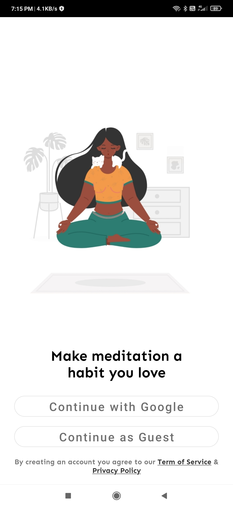
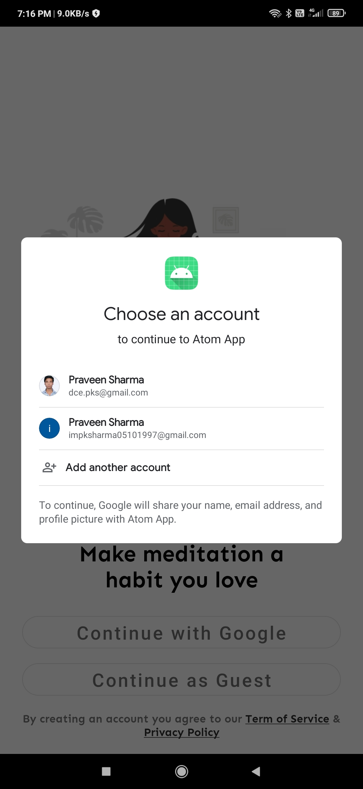
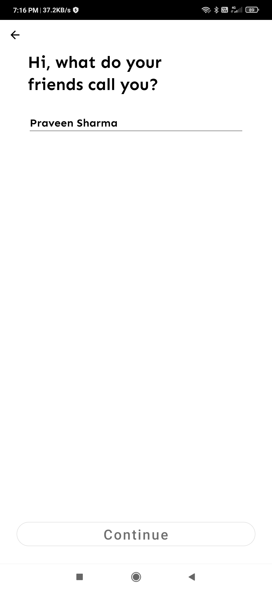
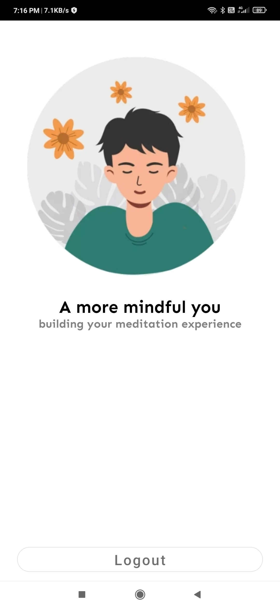

# [Atom App](https://github.com/Praveen101997/Atom-App)

## Problem Statement : 
### Build  a Login & Registration  Flow for an Android App using Firebase.

 
The app named BlendToMend has been developed with the aim of removing most of the unwanted and moving objects from a burst if 10+ images captured to render a final image which only contains the stable, non-moving objects which are desirable during a monument/landscape photography scenario.

## The application has been tested with:

* Android Compile SDK '29'
* Android Build Tools '29.0.3'
* Gradle '4.0.0 '

## Configuration / Usage:

* Make sure you have `Android SDK` up to date.
* Setup project with Firebase using https://firebase.google.com/ .
* Register App by providing Android package name, App nickname, Debug signing certificate SHA-1.
* Download and copy config file (google-services.json) while doing setup in project app directory.
* After complete setup enable sign-in method using Google and Anonymous.
* Enable Realtime Database. 
* Sync gradle
* Run the application

----

## App Screenrecording

## Sample App GIF
[Alt Text]("assets/app_sample1.jpg")

## Sample App Image

----

----

----

----
